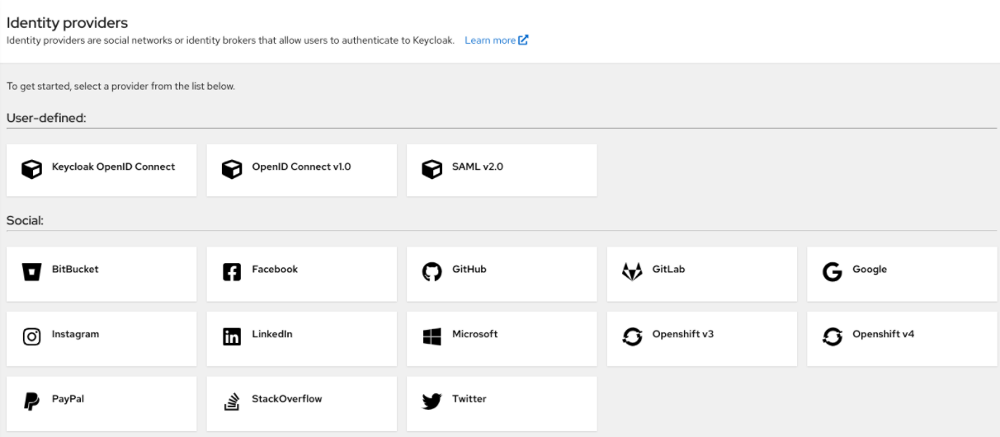
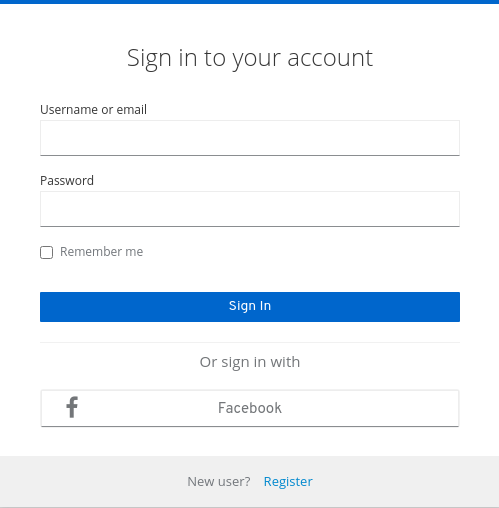
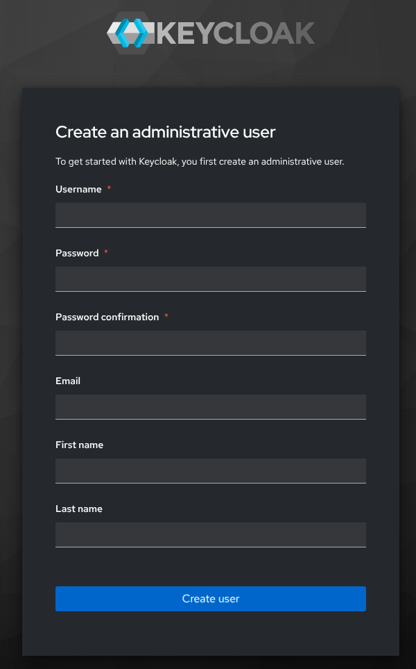
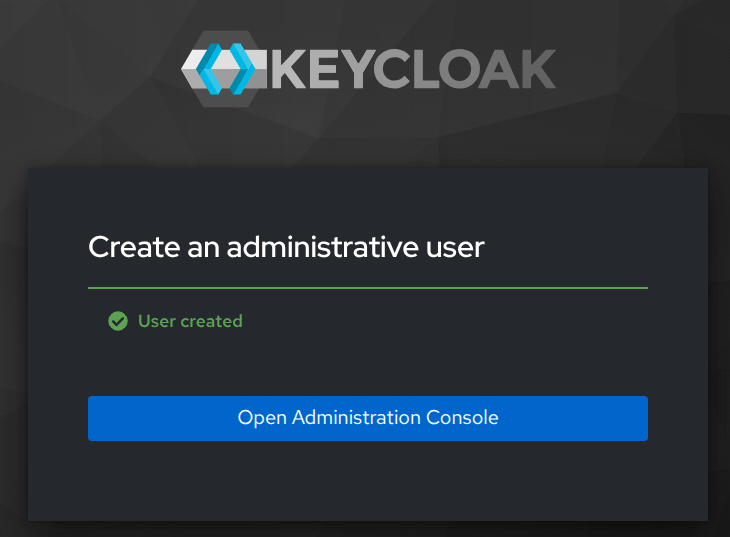

# Auth @ Keycloak

Step-by-step guide

## Why KeyCloak?

1) Protecting user credentials by yourself is hard. 
The sooner we master a battle-tested solution the better.
2) We may need "Login with Google / LinkedIn / Microsoft"
features sooner than we expect. Keycloak comes with support 
for social media identity providers out of the box.





## Are there any drawbacks?

Unfortunately yes. Users are stored in a different database than business data.
This complicates backups & restore and reaching for user data.

## Identity database

Let's start by creating identity postgres database.
I did it on Linux by running:

```shell
sudo -u postgres psql
```
and issuing these SQL commands:

```postgresql
create user identity with password 'identity';
create database identity with owner identity;
```

## Java install
I use the OpenJDK 25.03 (Temurin, LTS) which IntelliJ IDEA downloaded into *~/.jdks/temurin-25.0.3* folder.
In my *~/.bashrc* file, these two lines make *java* command available to run:

```shell
export JAVA_HOME=$HOME/.jdks/temurin-25.0.3
export PATH=$PATH:$JAVA_HOME/bin
```

## Keycloak install
Go to https://www.keycloak.org/downloads, 
download the latest archive and extract it to a folder of preference.
In my case it was ~/Developer/keycloak. To run keycloak I have created a 
~/Developer/identity folder and a simple *start.sh* script:

```shell
#!/bin/bash
export KEYCLOAK_HOME="${HOME}/Developer/keycloak"
"${KEYCLOAK_HOME}/bin/kc.sh" start-dev \
  --http-port '9090' \
  --db 'postgres' \
  --db-url 'jdbc:postgresql://localhost/identity' \
  --db-username 'identity' \
  --db-password 'identity'
```
It starts Keycloak in development mode, on port 9090, using postgres driver,
connects to "identity" database, with "identity" user and the same password.
Now you can run Keycloak ...

```shell
chmod +x ./start.sh
./start.sh
```
If you read logs, you can see that:
1) Keycloak creates its database schema
2) It is listening on http://localhost:9090

Open the abovementioned address, and create an administrative user.
Once you finish, click "Open Administration Console" and login as admin.





You should see "master" realm (it means: a kingdom or a domain ruled by a monarch).

## Create Norman realm!

DO NOT work with "master" realm. 
Instead, click "Manage realms" in the sidebar, and create a new one, called "norman" (lowercase like "master"). 
When created, click "Realm settings" in the sidebar, and add "Norman" as a display name.
Go back to "Manage realms" and make sure Norman is the "Current realm".