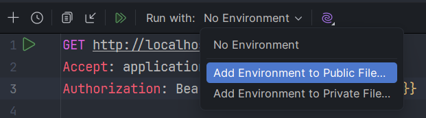
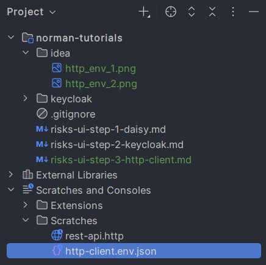
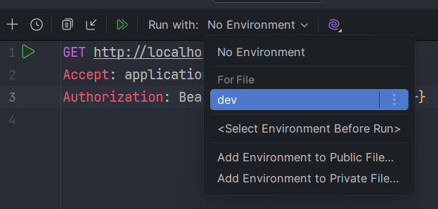
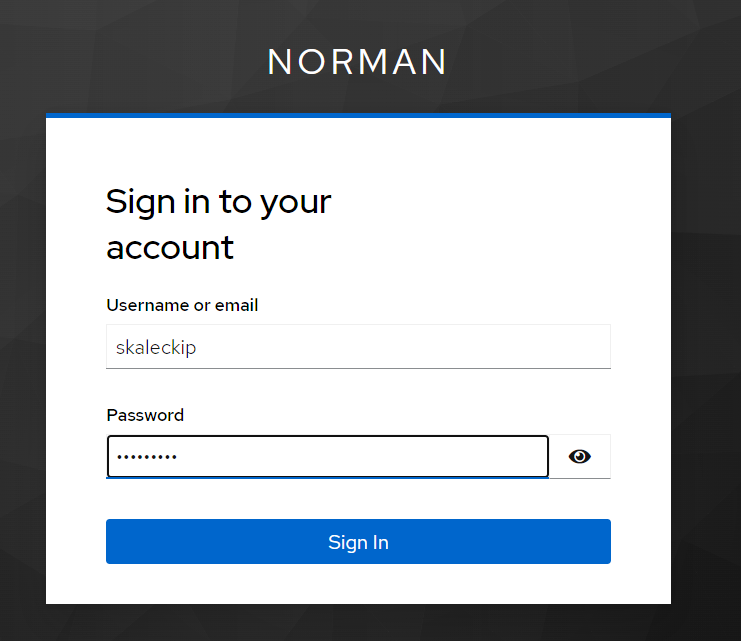
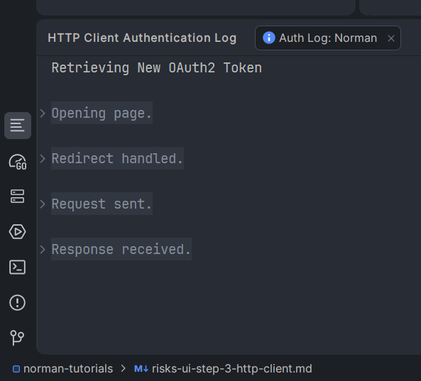
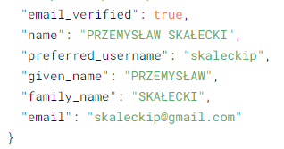
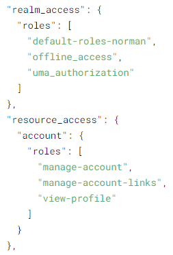

# IntelliJ IDEA HTTP Client @ OAuth2 & OpenID Connect

Before we extend the React application, let us use IntelliJ Http Client to test sending some http requests to a non-existing API, yet with a regular access token.

## Make sure the Keycloak is running

You remember ... you have a *start.sh* script ;-)

## Open the risks-ui project

Open the risks-ui project created in step 1 with IntelliJ IDEA. Go to menu *Tools* / *HTTP Client* / Create Request in HTTP Client.

You should see a new file like this:

```aiignore
GET http://localhost:80/api/item?id=99
Accept: application/json

###
```
Change it to:
```text
GET http://localhost:8080/api/risks
Accept: application/json
Authorization: Bearer {{$auth.token("Norman")}}
```
Essentially, we want to send a simple API request to a non-existent server. Still, we want IDEA to obtain authorization token from a security definition called "Norman". Let's create it

## Create security environment

Go to the file toolbar, drop down *Run with*, and select *Add Environment to Public File*. It HAS to be Public, so "Norman" will be available for selection in any *.http file.



IDEA will create *http-client.env.json* scratch file with a dummy content.



Now change the content of this file to:

```json
{
  "dev": {
    "Security": {
      "Auth": {
        "Norman": {
          "Type": "OAuth2",
          "Grant Type": "Authorization Code",
          "Client ID": "risks-ui",
          "Auth URL": "http://localhost:9090/realms/norman/protocol/openid-connect/auth",
          "Token URL": "http://localhost:9090/realms/norman/protocol/openid-connect/token",
          "Redirect URL": "http://localhost:5173/callback",
          "PKCE": {
            "Code Challenge Method": "SHA-256",
            "Code Verifier": "YYLzIBzrXpVaH5KRx86itubKLXHNGnJBPAogEwkhveM"
          },
          "Scope": "openid profile email"
        }
      }
    }
  }
}
```

It defines a "dev" Http Client environment, with authorization security definition "Norman", which
- uses OAuth2 "Authorization Code" flow, 
- for a client "risks-ui", 
- contacting Keycloak under previously seen addresses, 
- simulating callback address correctly, 
- forcing PKCE, which uses "Code Verifier" as our "banknote", and producing its "half" as a cryptographic hash produced by the SHA256 algorithm.

If it's a bit daunting ... we'll explain a lot of this ... few more times.

## Send request ... using "Norman"

Go back to *.http file, and select "dev" environment.



Run the request by clicking green arrow on the left side of GET word.
You will be redirected to a Keycloak to login :-)



## Inspect the token

The request will of course FAIL :-( There is no API yet!
However, let us inspect the token first.

Go back to *http-client.env.json* and  click the similar green arrow
to the left of "Norman". The Auth Log window should show up.



Click the last section *Response received*, toggle *access_token* value visibility,
and Copy the ENTIRE access_token ("access_token": "<COPY THIS TO THE END>").

Go to https://www.jwt.io/ and paste into the *Encoded token* window.
Allow to act, if you will be asked and inspect *Decoded header* (how the token was signed by Keycloak)
and *Decoded Payload* (this is the actual access token content) and the *JWT Signature Verification* with "Valid public key" annotation.

OAuth2 attributes are underlined, and display tooltips with explanation.
OpenID Connect and Keycloak specific, are NOT explained.



There is quite a lot of information on the user.



There are some information on user roles, which we'll talk about later.
Suffice to say, we need to convert these roles to ROLE_* values that Spring Boot Security supports.