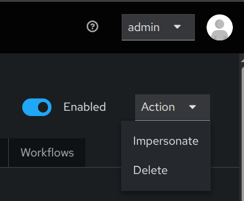
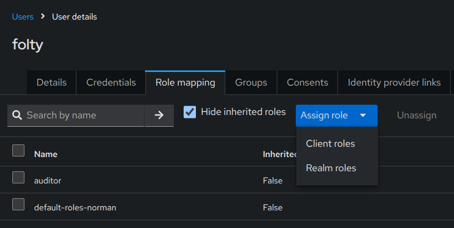
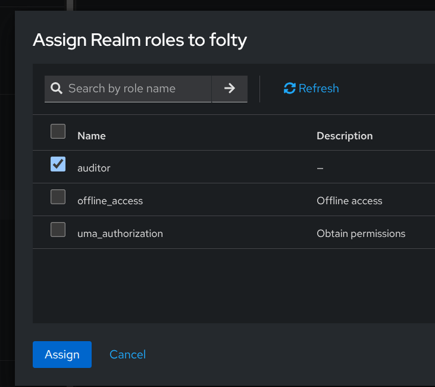

# Speaking about roles

Keycloak has two categories of roles: realm and client roles.
As the names suggest, realm roles are defined at the realm level, whereas client roles are associated with a given
client. Semantically, a realm role represents a user role within the whole organization (i.e., represented by the
realm). Client roles represent a "role" that is only meaningful within that client.
In the abovementioned token content "default-roles-norman", "offline_access" and "uma_authorization" are realm roles.
Whereas, the "manage-account", "manage-account-links" and "view-profile" are roles only
important for an "account" application (part of Keycloak), allowing the user to view/update his own account.
If you wish to know how it looks like, in the Keycloak Admin Console, go to the user of interest,
and select *Impersonate* from *Actions* menu.

## The "auditor" role

We need a role for an ISO 27K auditor. For simplicity call it that ("auditor").
In the sidebar, go to *Realm roles* and click *Create role*. Then, enter the role name,
optionally some description and click *Save*.

## There can be ONLY ONE!

Add a new user. Let it be "folty". Enter his data.
Do not forget to set NON-TEMPORARY password, optionally add a ALREADY VERIFIED email.
With the user details open, go to *Role mapping* tab, click *Assign role*, select *Realm roles*,
and check the "auditor" on.

Finally, click *Assign* to make "folty" user an auditor. 